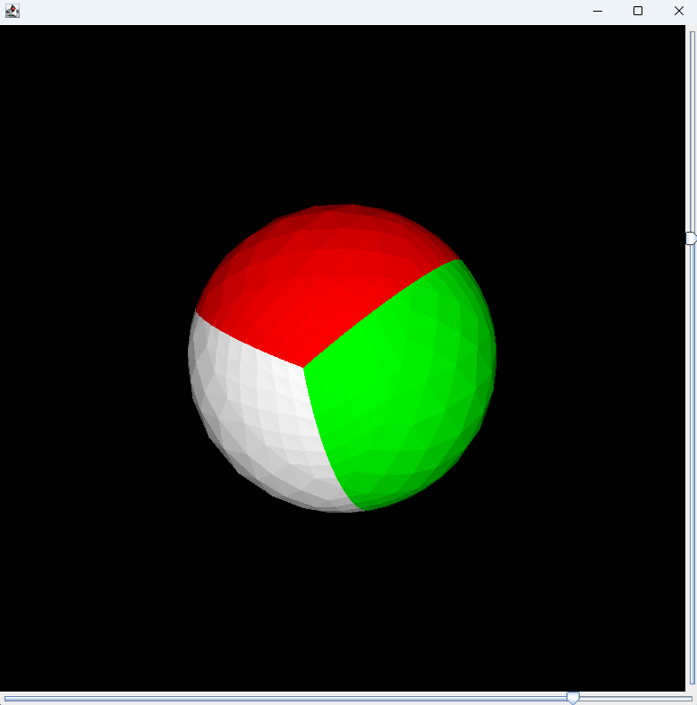

# Simple 3D Render Engine
## Description
This project is a simple 3D render engine using only Java. It render a multicolor 3D sphere that can rotate in his XZ and YZ axes using sliders.
## Final Render

  

## Credit
This project was made using this tutoriel : [tutoriel](http://blog.rogach.org/2015/08/how-to-create-your-own-simple-3d-render.html)

